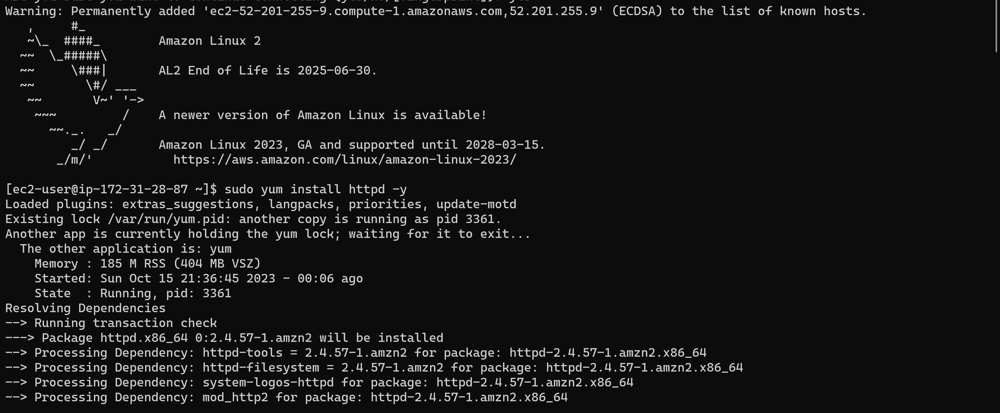
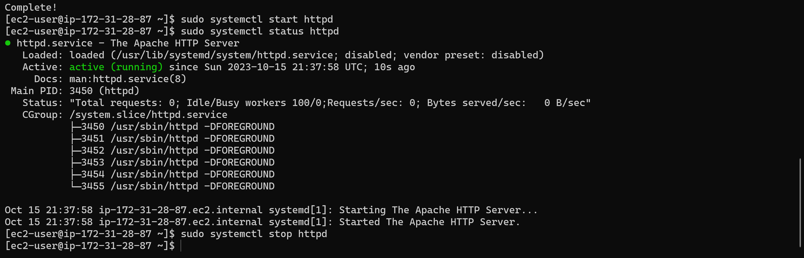
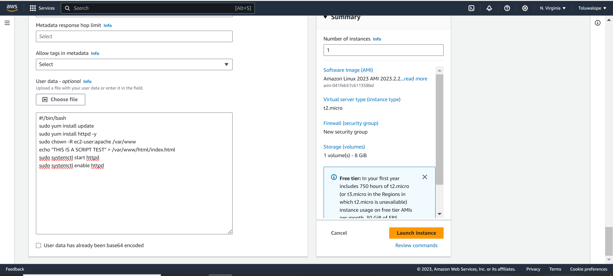
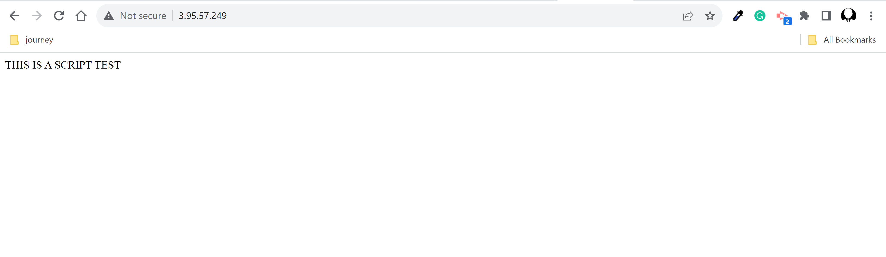

# Lab 3: Manage Packages and Services on a Linux VM on AWS

1. Create a Linux VM
2. Install the Apache Web Server
3. Start the service status via command line
4. Investigate the service status via command line
5. Stop the service
6. Challenge: Create a boostrapping script that will install and start this service on new EC2 VMs

Notes:

Install and Configure Apache (Ubuntu)

https://ubuntu.com/tutorials/install-and-configure-apache#1-overview How to install Apache on RHEL 8 / CentOS 8 Linux

https://linuxconfig.org/installing-apache-on-linux-redhat-8 How to use cloud-init to customize a Linux virtual machine in Azure on first boot

https://docs.microsoft.com/en-us/azure/virtual-machines/linux/tutorial-automate-vm-deployment Create bootstrap actions to install additional software

https://docs.aws.amazon.com/emr/latest/ManagementGuide/emr-plan-bootstrap.html

## Solution

1. Create a Linux VM, Install Apache Web Server

2. Start the service status via command line, Investigate the service status via command line,stop the service

## Challenge Solution
 Create a boostrapping script that will install and start this service on new EC2 VMs

 1. Create a Linux VM with user script

2. Test url to confirm if script worked.

