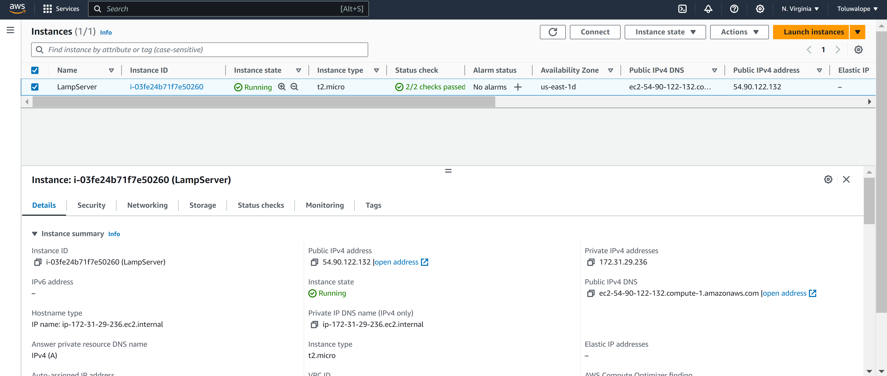
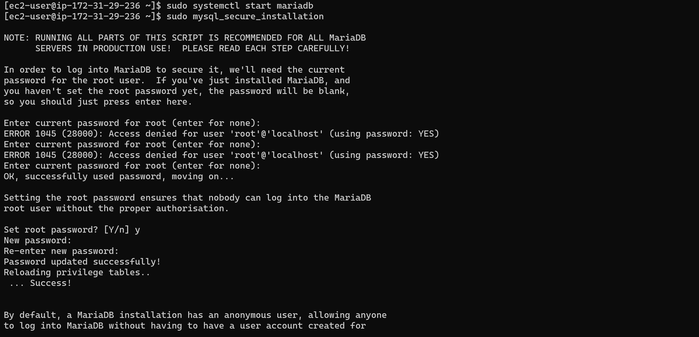

# Install a LAMP web server on Amazon Linux
Tasks:

1. Prepare the LAMP server
2. Test your LAMP server
3. Secure the database server
4. Install phpMyAdmin

Guide: 

https://docs.aws.amazon.com/AWSEC2/latest/UserGuide/install-LAMP.html

Grading tip: Screenshot major script outputs and upload with your step by step answer

## Solution

1. Launch EC2 Instance

2. Install Apache,Database(MariaDB),php

    

3. Start Apache

4. Add ec2-user to group,grant permission to group and change ownership 

    echo "phpinfo()" and verify
    

5. Secure the database server

6. Install PHP Mbstring extension and phpMyAdmin

7. Verify Access to admin tool and Database

