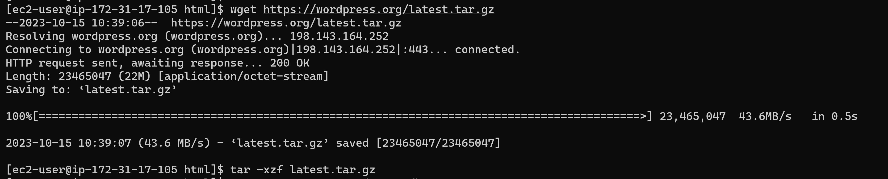
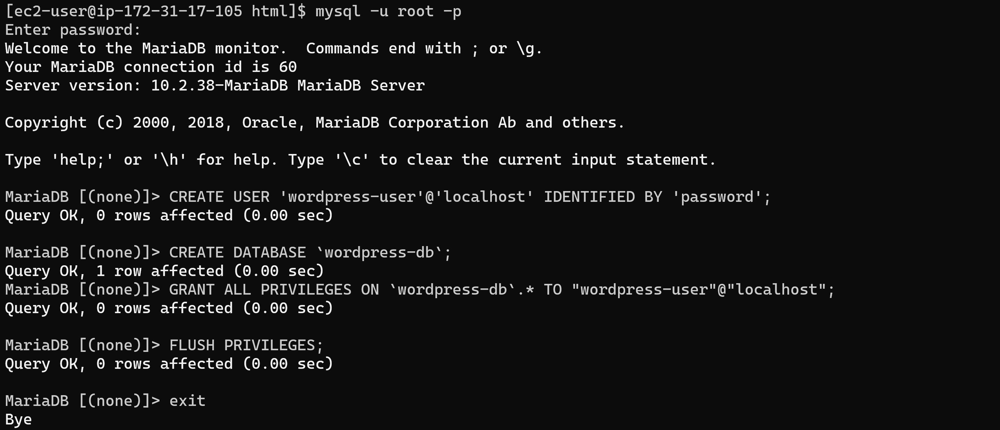
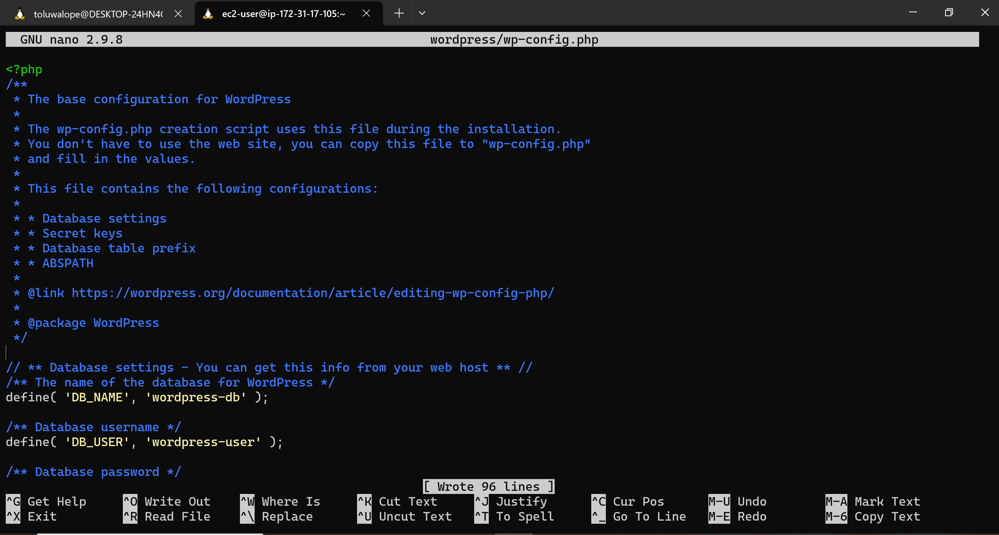
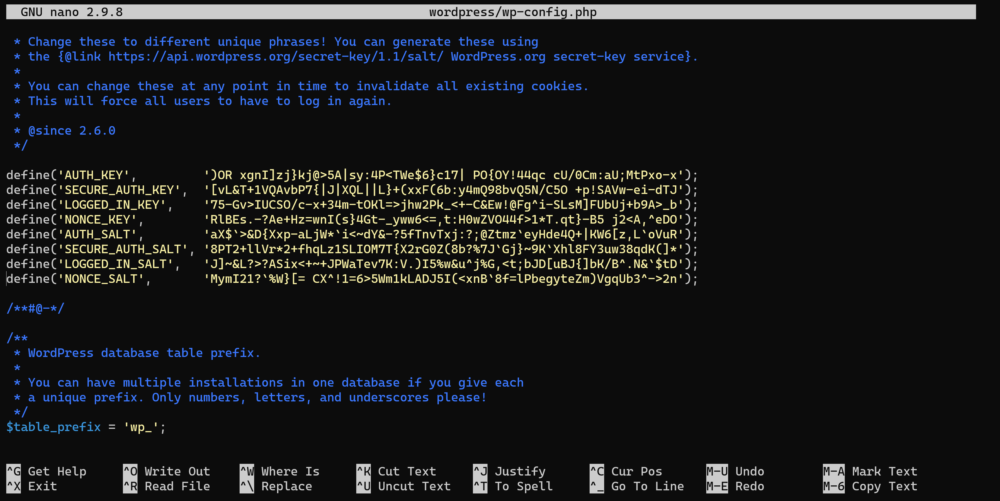
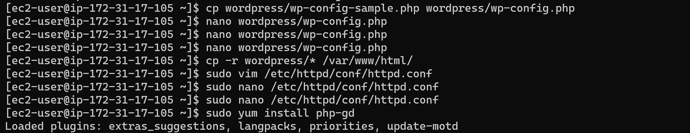
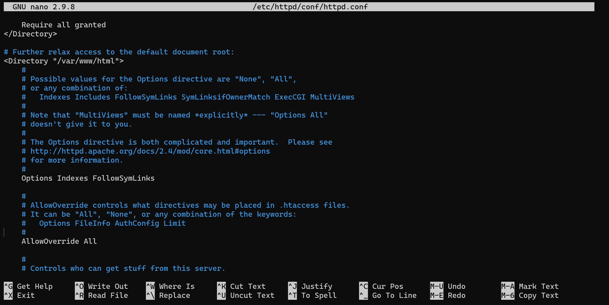
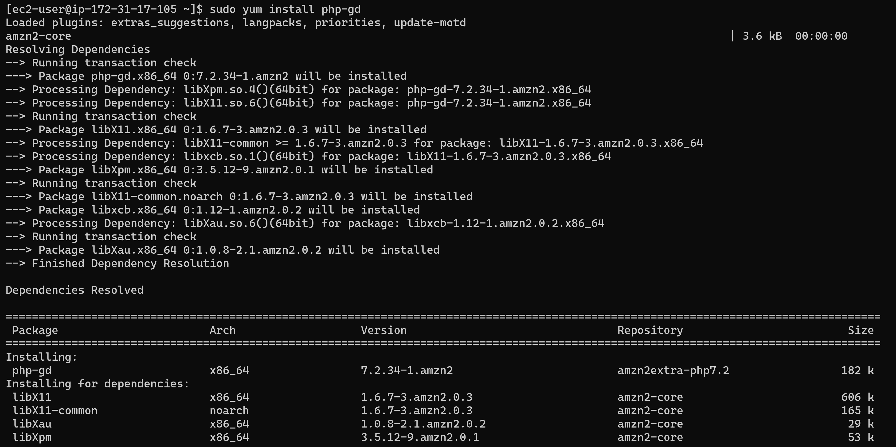
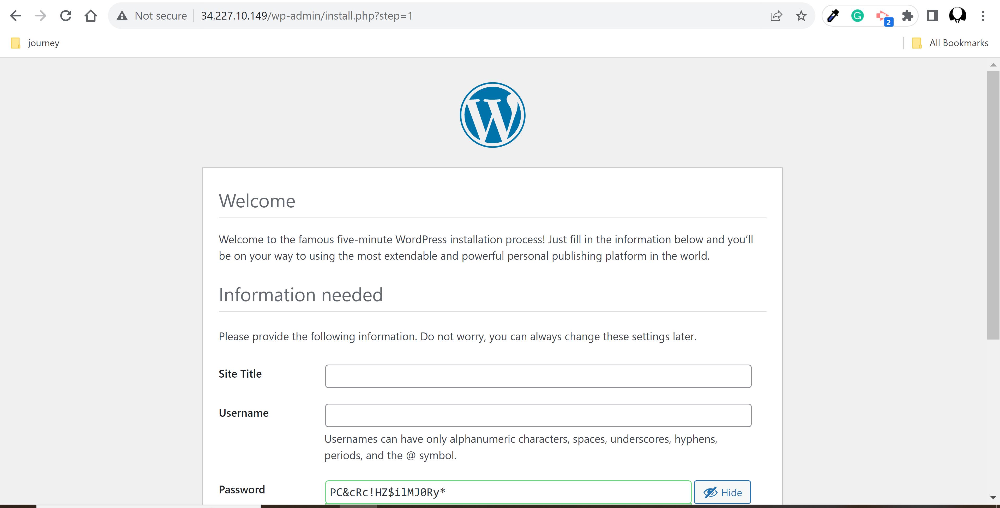

# LAB: 
# Host a WordPress blog on Amazon Linux

## Task:

Download word press installation package. 
Input this line of wget command in your shell to install wordpress
wget https://wordpress.org/latest.tar.gz

1. Create a database user and database for your WordPress installation
2. Create and edit the wp-config.php file (use the guide
3. Install your WordPress files under the Apache document root)
4. Install the PHP graphics drawing library on Amazon Linux 2.
5. Create an AMI of this running instance.
6. Perform clean up operations.

   
Guide: https://docs.aws.amazon.com/AWSEC2/latest/UserGuide/hosting-wordpress.html

Grading tip: Screenshot major script/console outputs and upload with your step by step answer

## Solution

N.B This solution begins after the LAMP Server has been setup as in lab 1

1. Download WordPress installation package.

2. Create a database user and database for your WordPress installation

3. Create and edit the wp-config.php file

    

4. Install your WordPress files under the Apache document root

    

5. Install the PHP graphics drawing library on Amazon Linux 2

6. View WordPress blog

