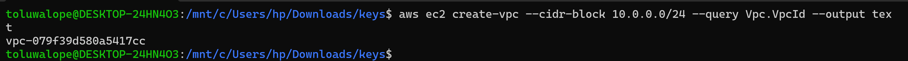
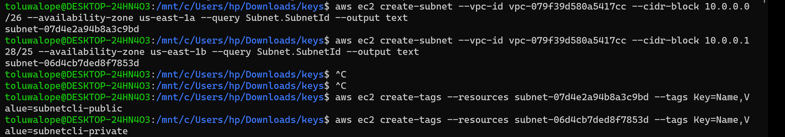
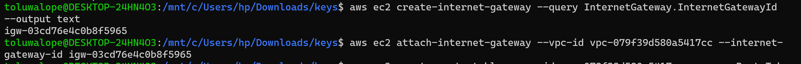
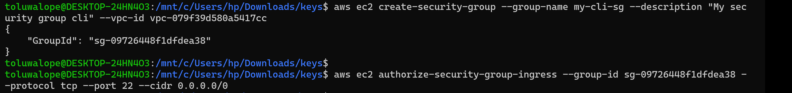
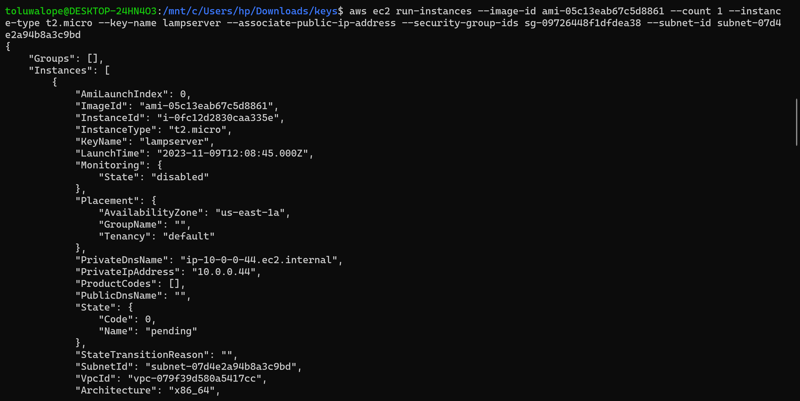
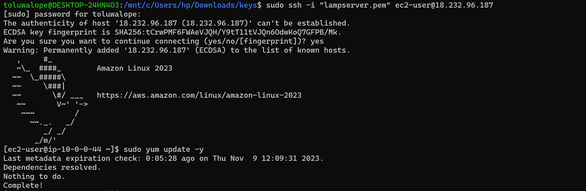

# Create a VPC from the CLI

Here you will follow the guide to using the command line interface to set up a VPC

# Task Guide

# Task: Create a non-default VPC using AWS CLI

1. Open your CLI and run a configuration setting
2. Launch a VPC 
3. Create two subnets (a public and a private subnet)
4. Make your subnet public by creating and attaching an internet gateway
5. Create a security group and add a SSH access from anywhere
6. Lauch an instance into your subnet 
7. Clean Up

# Submission
Attach a screenshot of completed steps in a submission folder.

# Guide
https://docs.aws.amazon.com/vpc/latest/userguide/vpc-subnets-commands-example.html

https://docs.aws.amazon.com/vpc/latest/userguide/vpc-subnets-commands-example-ipv6.html

https://docs.aws.amazon.com/vpc/index.html
https://docs.aws.amazon.com/vpc/latest/userguide/create-vpc.html#create-vpc-cli

## Note
Attach screenshot of every completed steps

## Solution
1. Open your CLI and run a configuration setting

2. Launch a VPC 
  

3. Create two subnets (a public and a private subnet)
  

4. Make your subnet public by creating and attaching an internet gateway
  

5. Create a security group and add a SSH access from anywhere
  

6. Lauch an instance into your subnet 
  

