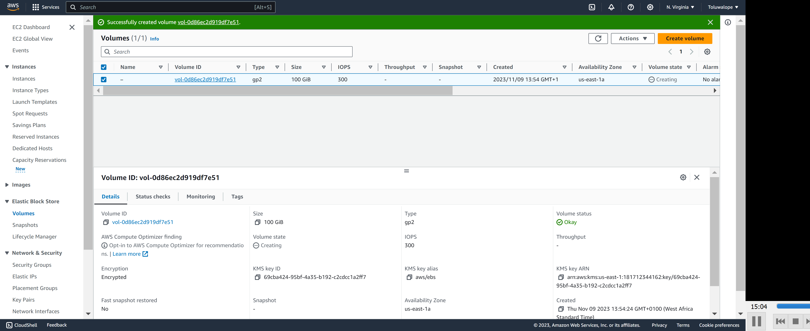
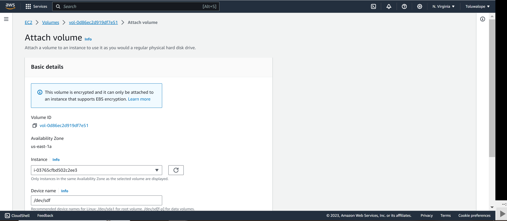
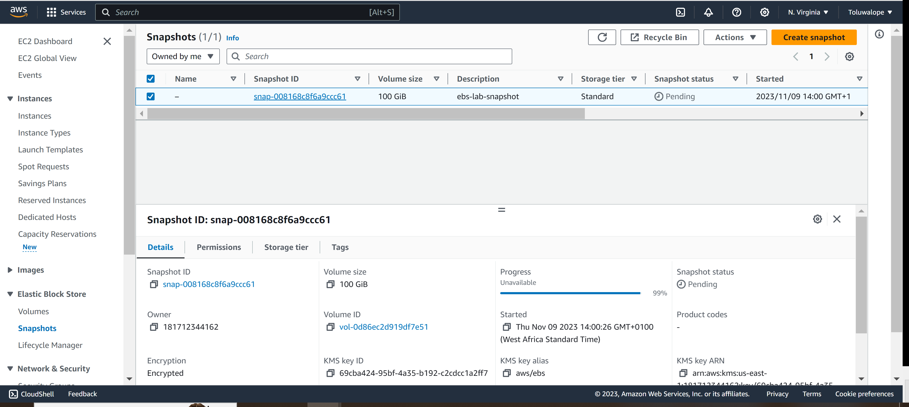
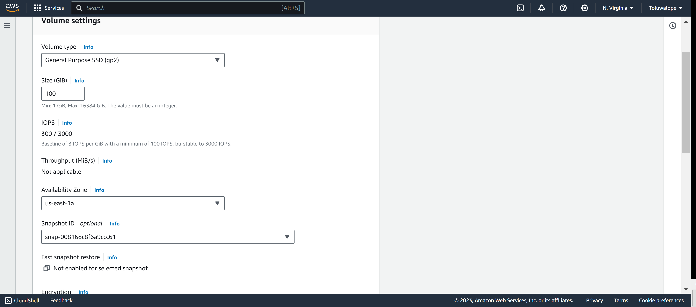
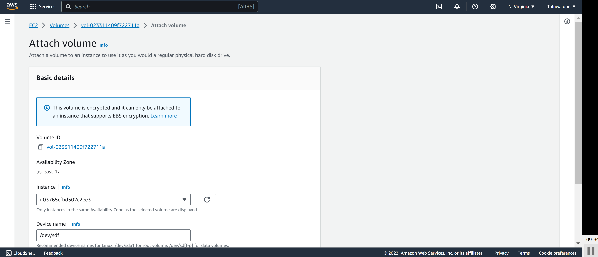
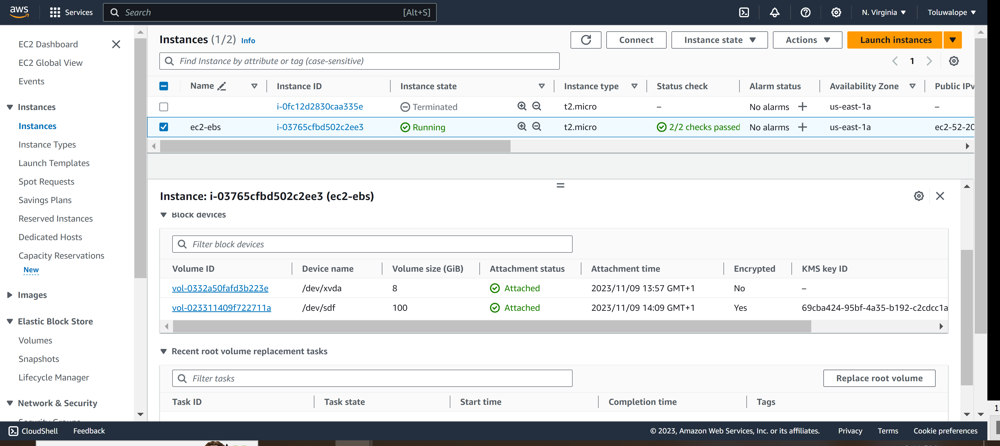

# Working with EBS
## Aims and Objectives
1. Familiarity with increasing storage component of an EC2 instance

## Tasks:

1. Create an Amazon EBS volume
2. Attach and mount your volume to an EC2 instance
3. Create a snapshot of your volume
4. Create a new volume from your snapshot
5. Attach and mount the new volume to your EC2 instance
6. Perform clean-up operations.

## Guide:

To achieve tasks 1-6, kindly follow the step-by-step guide in the link provided by AWS.

https://docs.aws.amazon.com/AWSEC2/latest/UserGuide/ebs-volumes.html

https://docs.aws.amazon.com/AWSEC2/latest/UserGuide/ebs-attaching-volume.html

## Solution

1. Create an Amazon EBS volume
  
  

2. Attach and mount your volume to an EC2 instance  
  

3. Create a snapshot of your volume  
  
  

4. Create a new volume from your snapshot
  
  

5. Attach and mount the new volume to your EC2 instance
  
  
  