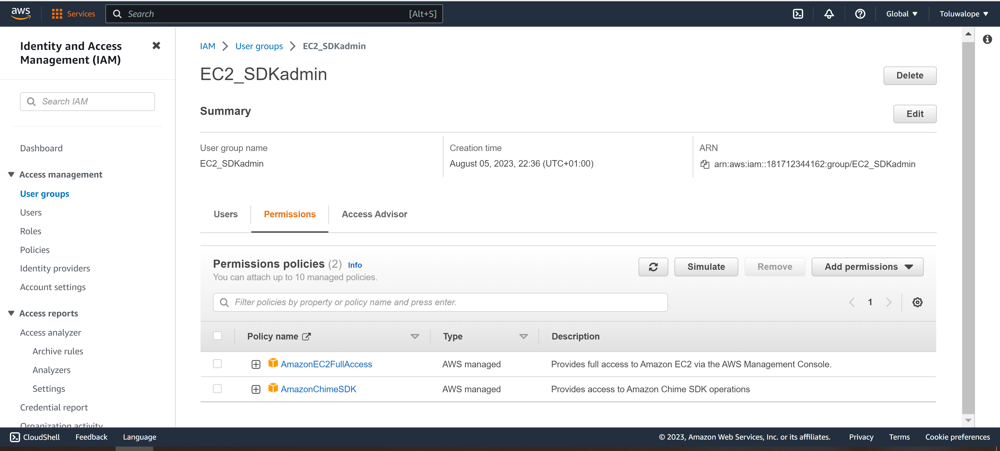
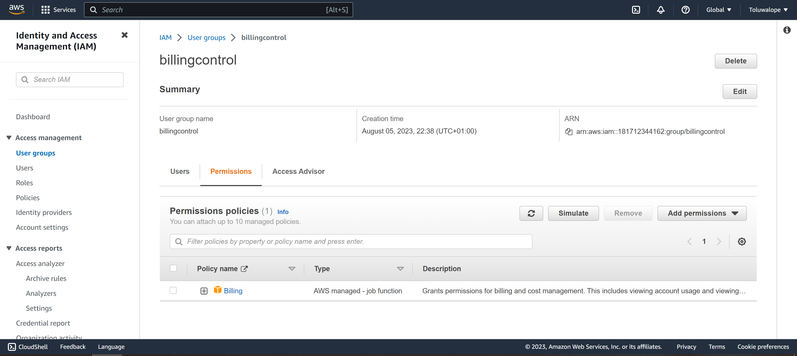
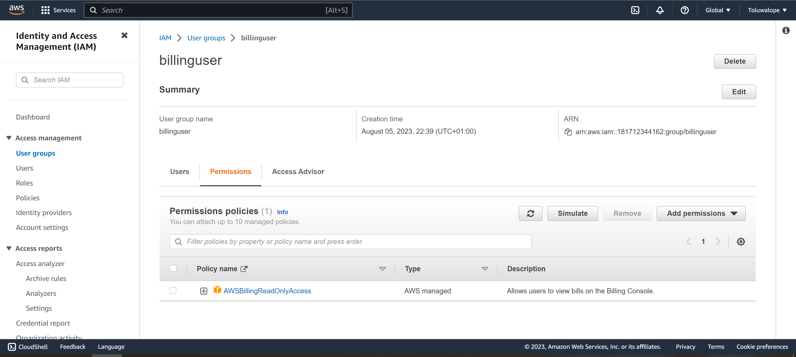

Working with IAM management console

Tasks

1. Login to your root account
2. Create an IAM group with S3 read only acess (S3 support).
3. Create an IAM group with EC2 read only acess (EC2 support)
4. Create an IAM group with EC2 full access (EC2 admin)
5. Create 3 IAM users and add to the each group above as descibe below:

user      group          permissions
user1     EC2 support     Read-Only access to Amazon EC2
user2     S3 support      Read-Only access to Amazon S3
user3     EC2 admin       Full access to Amazon EC2 instances

6. Test your design

7. Perform clean up operations

Replicate the process above forthe Schulltech organization described below:

|user               |group        |  permissions

adminstaff - -  EC2 support ---        | Read-Only access to Amazon EC2

|Techstaff          |S3 support           |Full access to S3

|ITexpert           |EC2/SDK admin        |full access to EC2 and SDK

|financialmanager   | billingcontrol      |Billing Full Access  

|financeuser        |billinguser          |Billing view access

https://docs.aws.amazon.com/IAM/latest/UserGuide/tutorial_users-self-manage-mfa-and-creds.html

Submitting the assignment

1. Take a screenshot of each completed step
2. Attach the screenshot to an output directory
3. Push the updated repository to your own git account

## Solution

### User Group
1. EC2 support

2. S3 support 

3. EC2/SDK admin

4. billingcontrol

5. billinguser

### Users

### Test
1. Adminstaff

2. Techstaff

3. ITexpert

4. financialmanager

5. financeuser

